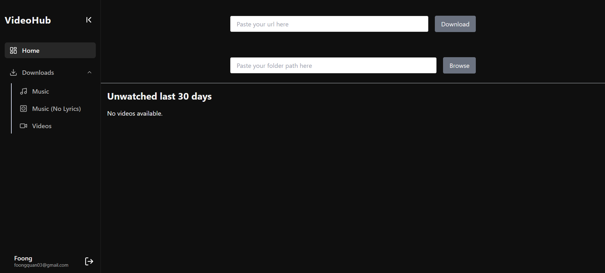
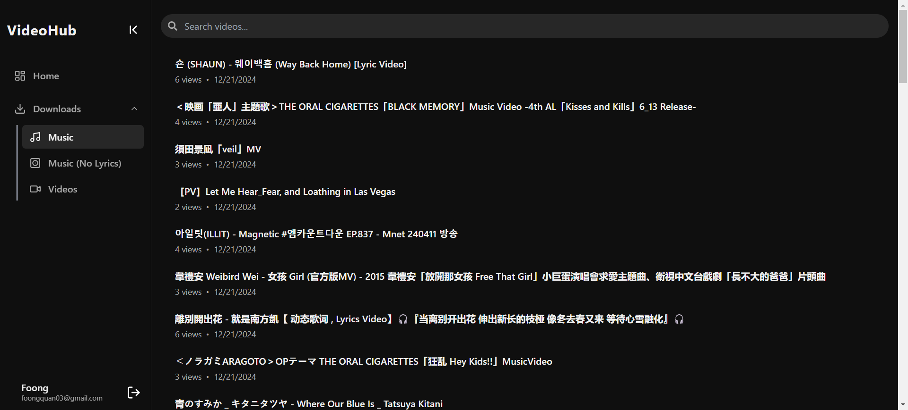
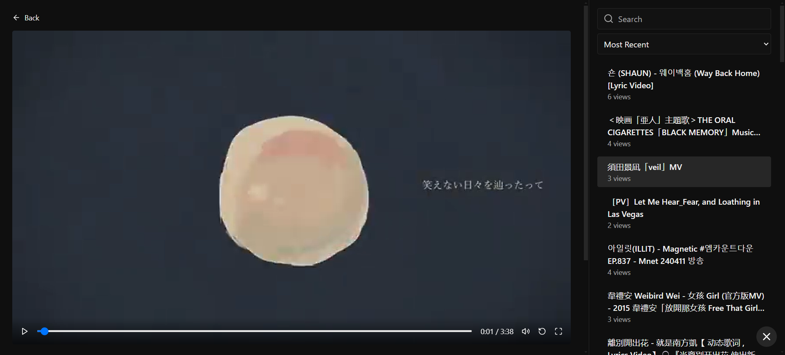
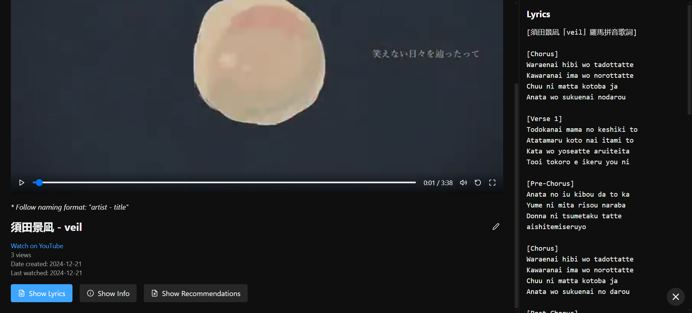
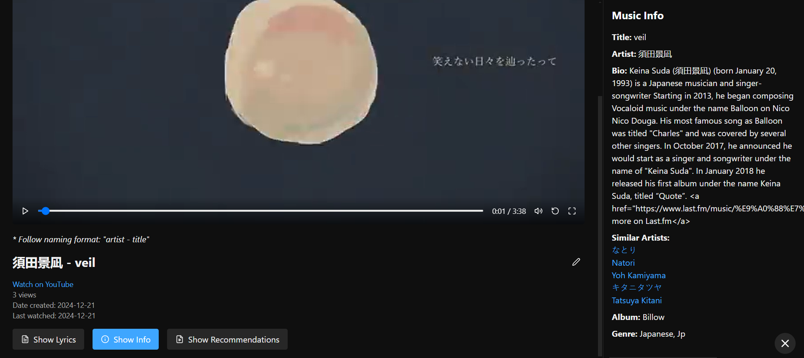
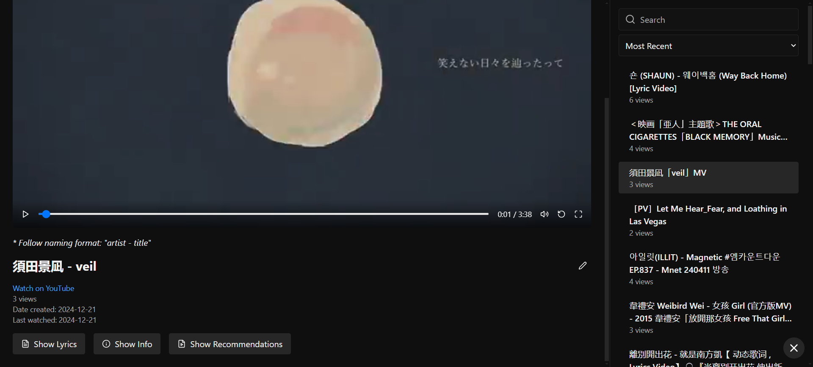
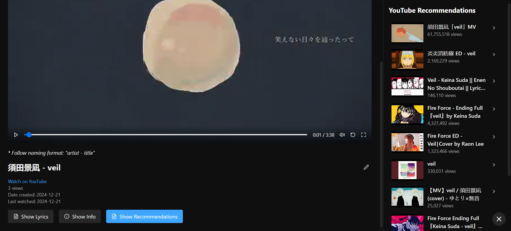
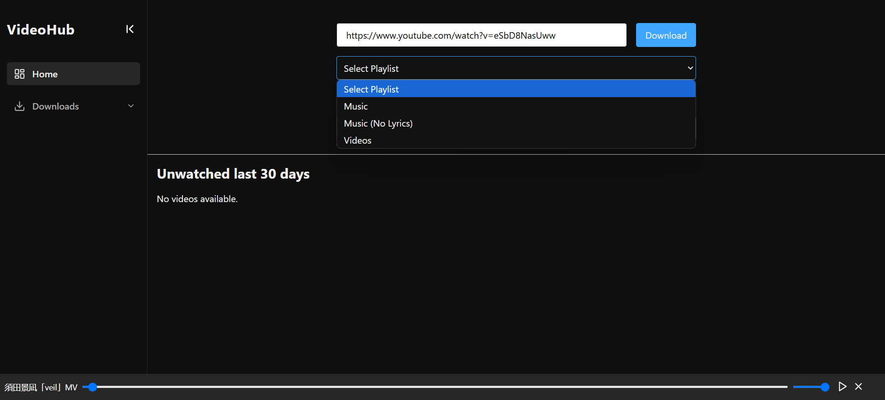

# video-hub-frontend

## Technology Stack
- Frontend: React + TailwindCSS
- Backend: Express (Node.js)
- Store metadata: MySQL / PostgreSQL
- API: YouTube API, Genius API, Last.fm API

## Preview
- Home

- Downloads

- Video

- Lyrics

- Video metadata

- Default Sidebar

- YouTube Recommendations

- Functionalities: Download video, Access folder path

